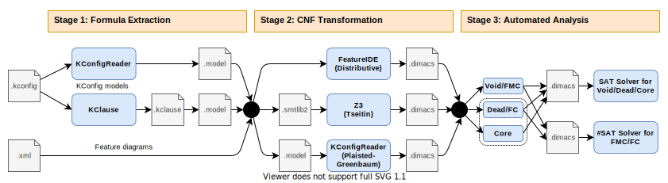

# Tseitin or not Tseitin? The Impact of CNF Transformations on Feature-Model Analyses



This repository provides Docker-based automation scripts for investigating transformations of feature-model formulas into conjunctive normal form (CNF) and evaluating the impact of such CNF transformations on subsequent feature-model analyses using SAT and #SAT solvers.

The repository has several purposes:

* First, it contains all evaluation scripts for our ASE'22 paper *Tseitin or not Tseitin? The Impact of CNF Transformations on Feature-Model Analyses* (authored by Elias Kuiter, Sebastian Krieter, Chico Sundermann, Thomas Thüm, and Gunter Saake).
    
    **The replication package for our ASE'22 paper is available [here](https://doi.org/10.5281/zenodo.6525375).**
    It was generated according to the instructions below.
* Second, it can be used to build a repository of feature models for Kconfig-based open-source projects (superseding [ekuiter/feature-model-repository-pipeline](https://github.com/ekuiter/feature-model-repository-pipeline)).
* Third, it demonstrates how to apply the [FeatJAR](https://github.com/FeatJAR) infrastructure for authoring reproducible evaluations concerned with feature-model analysis.

To support the first two use cases, we ship `params_ase22.ini` for replicating the evaluation of our ASE'22 paper and `params_repo.ini` for extracting a feature-model repository.

## Getting Started

Regardless of the use case, these steps should be followed to set up the automation correctly.

* First, install [Docker](https://docs.docker.com/get-docker/) on a 64-bit Linux 5.x system or [WSL 2](https://docs.microsoft.com/de-de/windows/wsl/install).
    On Arch Linux, for example, run:
    ```
    usermod -aG docker $(whoami) # then, log out and in again
    sudo pacman -S docker
    systemctl enable docker
    systemctl start docker
    ```
* Clone this repository:
    ```
    git clone https://github.com/ekuiter/tseitin-or-not-tseitin.git && cd tseitin-or-not-tseitin
    ```
* Then, choose the evaluation parameters and an extraction script.
    For replicating our ASE'22 evaluation, run:
    ```
    cp input/params_ase22.ini input/params.ini
    cp input/extract_ase22.sh input/extract.sh
    ```
    For creating a feature model repository, run:
    ```
    cp input/params_repo.ini input/params.ini
    cp input/extract_repo.sh input/extract.sh
    ```
* Finally, run the script with `./run.sh`.
* On a remote machine, run `screen -dmSL tseitin ./run.sh` and press `Ctrl A, D` to detach from an SSH session (run `screen -x tseitin` to re-attach and `sudo killall containerd dockerd kclause python3 java bash` to stop).
* To re-run the script, run `./clean.sh && ./run.sh`.

You can control which stages to (re-)run by prepolutating/removing files in the `output` directory.
For an overview over the individual stages, see the source code of `run.sh`.

## File Structure

All input information is contained in the `input` directory, including:

* the evaluation parameters (`params.ini`)
* the extraction script (`extract.sh`)
* feature-model hierarchies available in `params.ini$HIERARCHIES` (`hierarchies`)

During script execution, the `input` directory will also be populated with clones of all evaluated projects' repositories.

All results are then stored in the `output` directory, including:

* extracted feature models (`models`), named after the following scheme:
    ```
    [project],[version],[iteration],[source].[xml|model]
    ```
* DIMACS files for said feature models (`dimacs`), named after the following scheme:
    ```
    [project],[version],[iteration],[source],[transformation].[xml|model]
    ```
* intermediate results (`intermediate` and `stage*`), useful for debugging
* measurement results (`results_*.csv`)
* warnings and errors (`error_*.log`)

The R script `ase22_evaluation.R` can be used to analyze and visualize the measurement results by running it within `output` as the working directory.

## Reproducibility

In case any of the Docker images fails to build from scratch (e.g., some package is not available anymore or some server is down), we ensure reprocibility with the `export.sh` and `import.sh` scripts.

* To export all Docker images, as well as all input and output information, run `./export.sh`.
    The resulting `export` directory is suited for distribution as a replication package.
* Given such an export, the Docker images can be loaded by running `./import.sh`.
    The experiment can then be re-run with `rm -rf output && ./run.sh` after setting `SKIP_BUILD=n` in `input/params.ini`.

The replication package for our ASE'22 paper is available [here](https://doi.org/10.5281/zenodo.6525375).

## Debugging

To access the evaluation's Docker container while it is running (e.g., to `tail -f` the log file), run (where `$reader = kconfigreader|kclause`):

```
docker exec -it $(docker ps --filter name=$reader --format "{{.ID}}") /bin/bash
```

To start an interactive session in a (not already running) Docker container:

```
docker run -it $reader /bin/bash
```